# NREC College — Admin User Manual

Version: 1.0.0
Complete guide to managing the NREC College CMS.

---

## Table of Contents

- [Quick Start Guide](#quick-start-guide)
- [How to Log In](#how-to-log-in)
- [Dashboard](#dashboard)
- [Homepage Content](#homepage-content)
- [Website Pages](#website-pages)
- [Website Menu](#website-menu)
- [Departments](#departments)
- [Courses](#courses)
- [Faculty](#faculty)
- [Curriculum](#curriculum)
- [News & Articles](#news--articles)
- [Notice Board](#notice-board)
- [Events](#events)
- [Downloads](#downloads)
- [Media Library](#media-library)
- [Website Settings](#website-settings)
- [Help Center](#help-center)

---

## Quick Start Guide

Select a quick action to jump directly to the relevant instructions.

- **How to Log In**: Access your admin account
- **Update Homepage**: Change the hero banner & welcome
- **Publish Notice**: Post a new PDF notice
- **Add News**: Write a new news article
- **Upload File**: Share a PDF form or brochure
- **Add Faculty**: Add a new staff member

### Most Frequently Used Tasks
- Update the Principal's Message on the Homepage
- Update College Contact Phone Number
- Add a new link to the top Navigation Menu
- Upload a new PDF form for students to download

---

## How to Log In

**Purpose:** Access the Admin Panel to manage website content.
**When:** Every time you want to make changes to the live site.

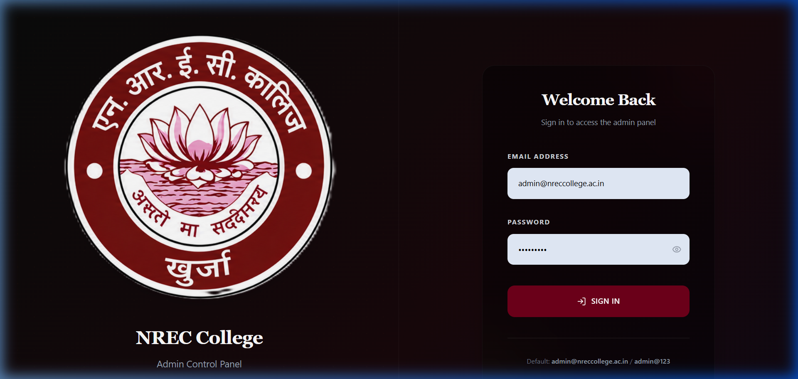

1. **Email Field** — Enter your administrator email (e.g., admin@nreccollege.ac.in).
2. **Password Field** — Enter your password. Click the eye icon to show/hide.
3. **Sign In Button** — Click to access the dashboard.

### Step-by-Step Instructions
1. **Open the Login Page**: Go to `/admin/login` in your browser.
2. **Enter Credentials**: Type your email and password.
3. **Click Sign In**: You will be redirected to the Dashboard automatically.

> **Tip (First Time Login):** Use the default credentials provided by IT and change your password immediately in Settings.

---

## Dashboard

**Purpose:** View an overview of the website's statistics and recent activity.

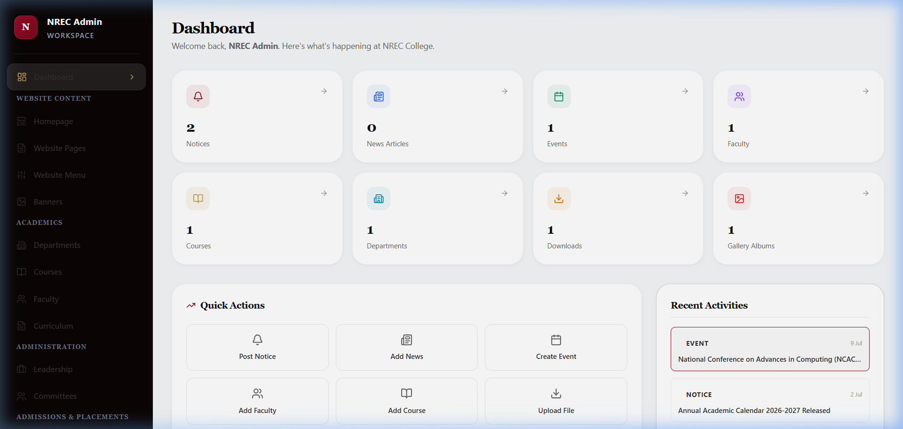

1. **Sidebar Navigation** — Use this menu to access all modules. Items are grouped by category.
2. **Statistics Cards** — Shows total counts of notices, news, events, faculty, courses, departments, downloads, and gallery albums.
3. **Quick Actions** — Shortcuts to create new notices, news, events, faculty, courses, or upload files.
4. **Recent Activities** — Shows the latest records added across all modules.

---

## Homepage Content

**Purpose:** Manage the content that appears on the front page of the website.

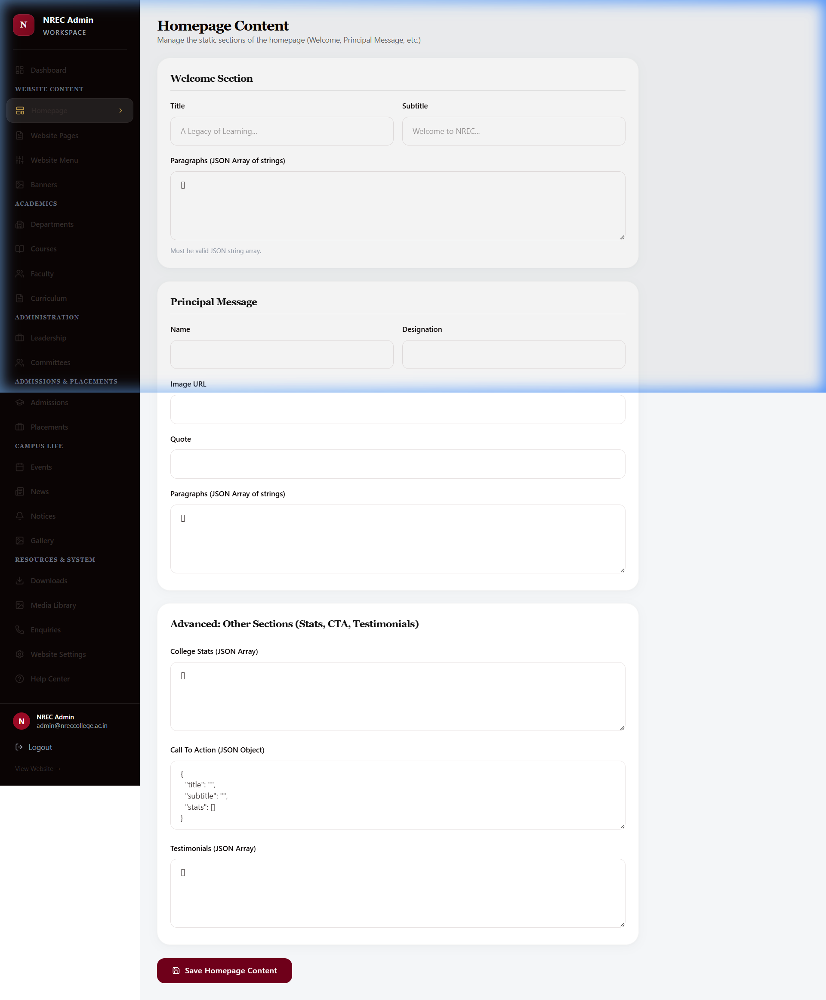

1. **Welcome Section** — Edit the Title and Subtitle that appear at the top of the homepage.
2. **Principal Message** — Update the Principal's name, designation, photo, and quote.
3. **Save Button** — Always click "Save Homepage Content" after making changes.

### Step-by-Step Instructions
1. **Navigate to Homepage**: Click "Homepage" in the sidebar under Website Content.
2. **Edit Content**: Modify the Welcome Section title, Principal Message, or Advanced sections.
3. **Save**: Click the "Save Homepage Content" button at the bottom.

> **Tip (JSON Fields):** Some fields like "Paragraphs" and "College Stats" use JSON format. Format them as: `["Item 1", "Item 2"]`

---

## Website Pages

**Purpose:** Edit the content of standard pages like About Us, History, Mission.

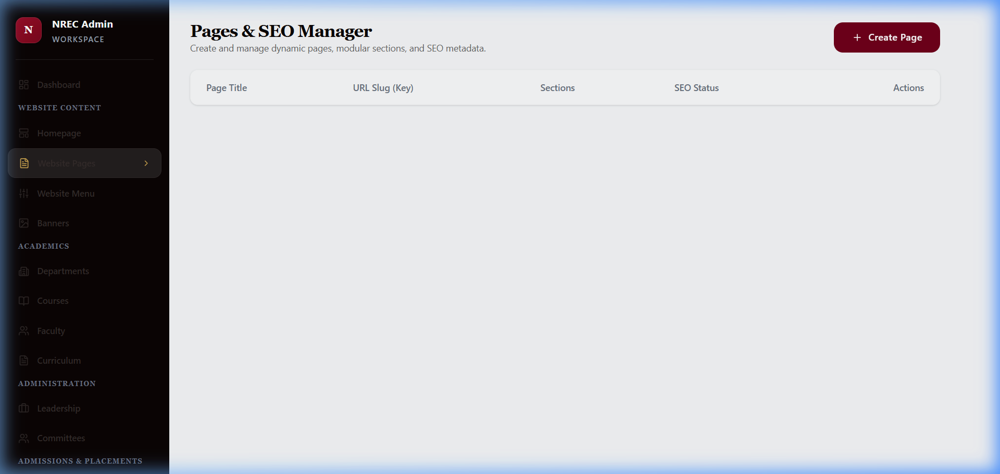

1. **Add New Page** — Click "Add New" to create a new website page.
2. **Page List** — View, edit, or delete existing pages from this table.

---

## Website Menu

**Purpose:** Control the top navigation bar of the website.

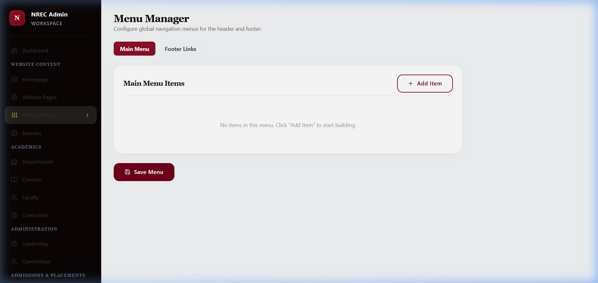

1. **Add Menu Item** — Click to add a new navigation link.
2. **Menu Table** — Drag to reorder, edit labels, or set visibility.

### Tips
- Keep menu labels short (1-2 words).
- Use the "Order" number to arrange them (lowest number appears first).

---

## Departments

**Purpose:** Manage academic departments (e.g. Science, Arts, Commerce).

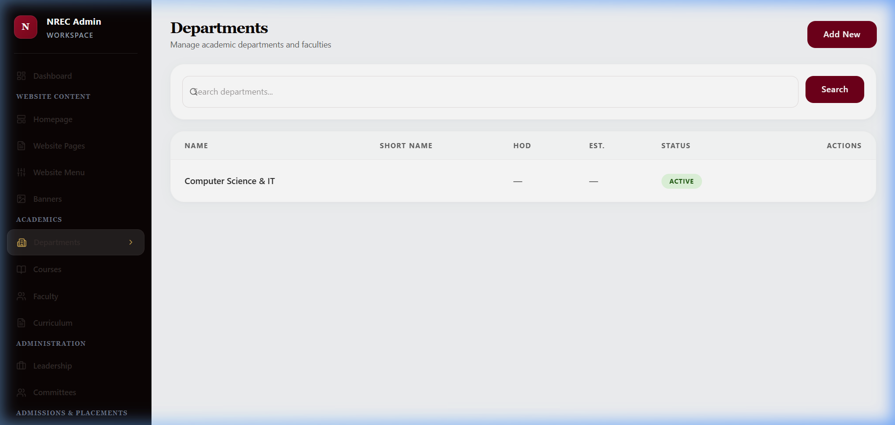

1. **Add New Button** — Click to create a new department.
2. **Search Bar** — Search departments by name.
3. **Department List** — View all departments with their details.

---

## Courses

**Purpose:** Manage courses offered by the college.

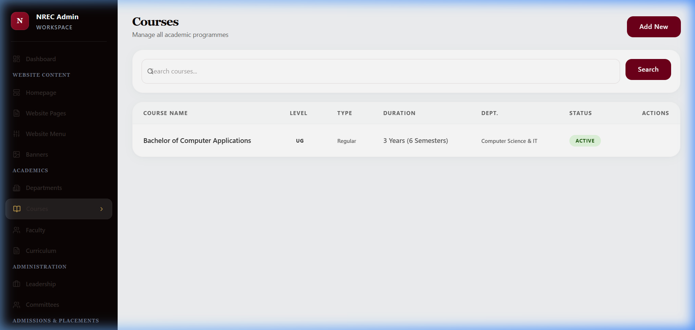

1. **Add New Button** — Click to create a new course.
2. **Search Bar** — Filter courses by name.
3. **Course List** — View all courses with duration, department, and status.

---

## Faculty

**Purpose:** Manage the directory of teachers and staff.

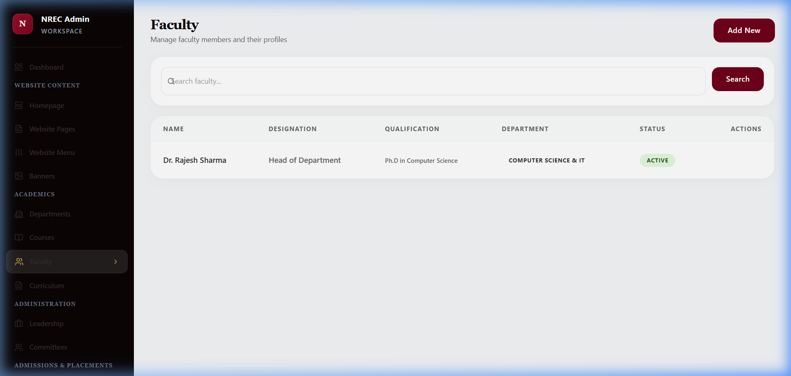

1. **Add New Button** — Click to add a new faculty member.
2. **Search & Filter** — Search by name or filter by department.
3. **Faculty Cards/List** — View all faculty members with photos, designation, and department.

---

## Curriculum

**Purpose:** Manage syllabi and course structures.

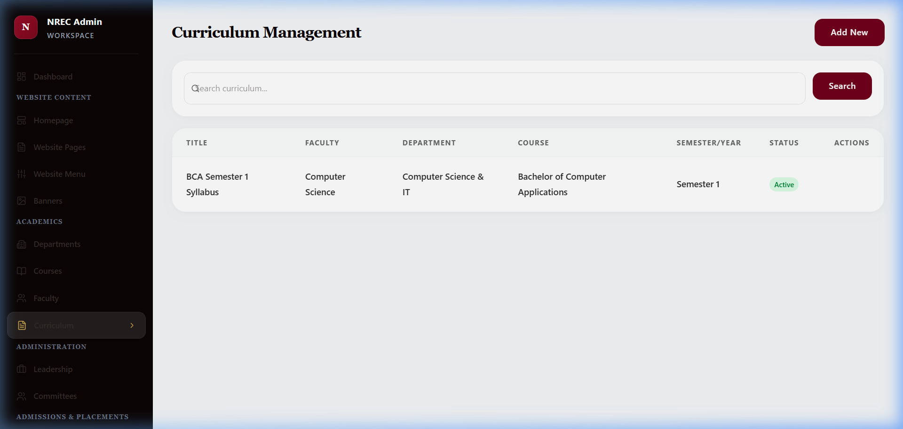

1. **Add New Button** — Click to add a new syllabus entry.
2. **Curriculum List** — View all syllabi with course, semester, and PDF download links.

---

## News & Articles

**Purpose:** Publish campus news articles and press releases.

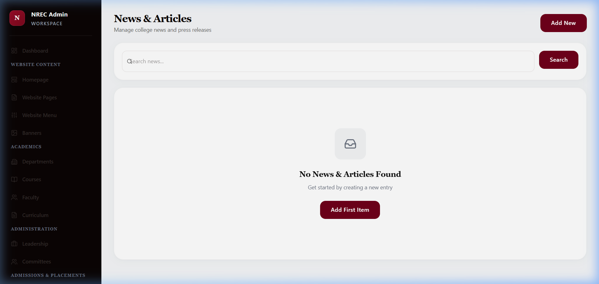

1. **Add New Button** — Click to write a new news article.
2. **Search Bar** — Filter news by keyword.
3. **News List** — View all news articles. Click "Add First Item" to get started.

### Step-by-Step: Add a News Article
1. **Click "Add New"**: Opens a form for the new article.
2. **Fill in Details**: Enter the title, content, and optionally upload an image.
3. **Set Visibility**: Toggle "Publish to Website" if you want it to appear immediately.
4. **Save**: Click "Save" to publish or save as draft.

---

## Notice Board

**Purpose:** Upload important PDF notices for students, faculty, and staff.

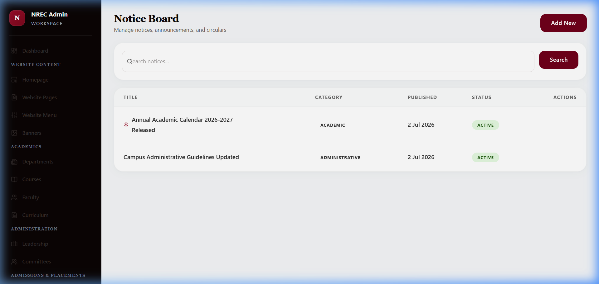

1. **Add New Button** — Click to create a new notice.
2. **Notice List** — View all notices with title, date, and attached PDF.

---

## Events

**Purpose:** Add upcoming campus events, seminars, and workshops.

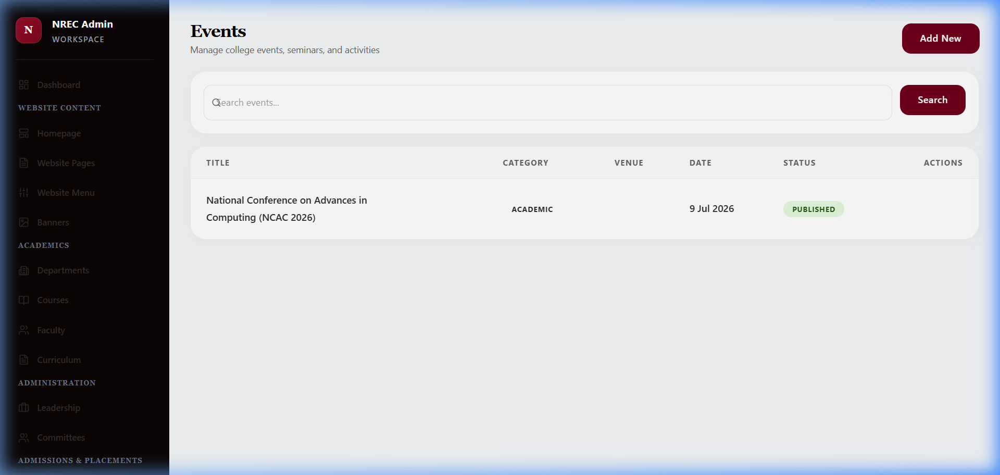

1. **Add New Button** — Click to create a new event.
2. **Event List** — View all events with title, date, location, and status.

---

## Downloads

**Purpose:** Provide downloadable PDF forms, brochures, and documents for students.

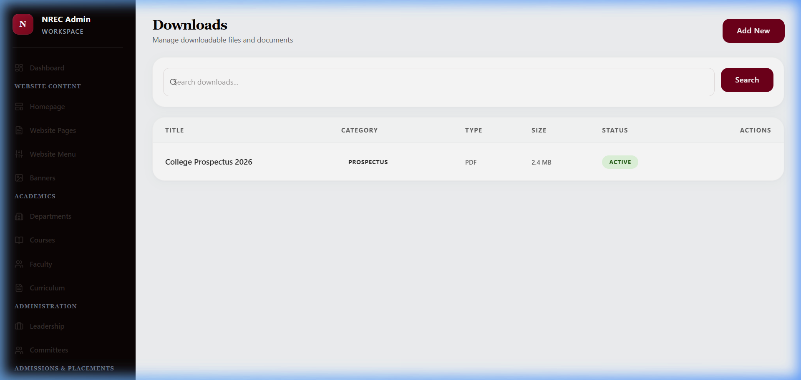

1. **Add New Button** — Click to upload a new downloadable file.
2. **File List** — View all uploaded files with title, category, and download count.

---

## Media Library

**Purpose:** View and manage all uploaded files (images, PDFs, documents).

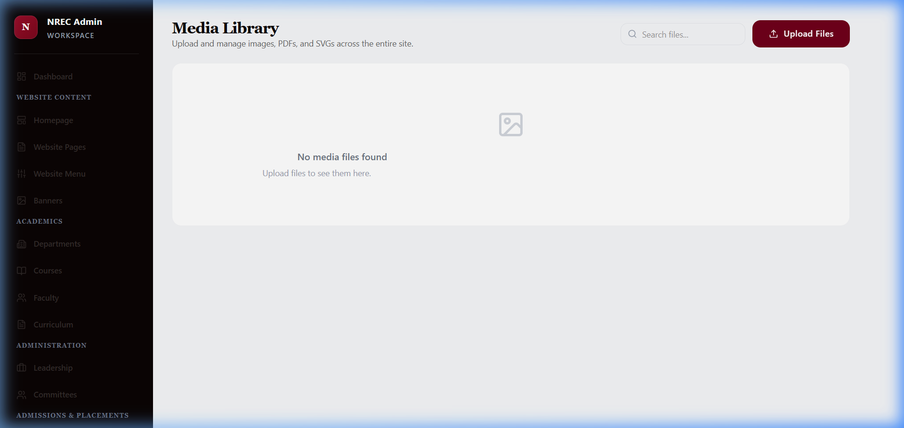

1. **Upload Button** — Click to upload a new image or file.
2. **File Grid** — View all uploaded media. Click to preview or copy the URL.

> **Image Best Practices:** Upload images in JPEG or PNG format. Keep file sizes under 2MB for faster loading.

---

## Website Settings

**Purpose:** Update global information like College Name, Email, Phone, Address, Social Links, and SEO.

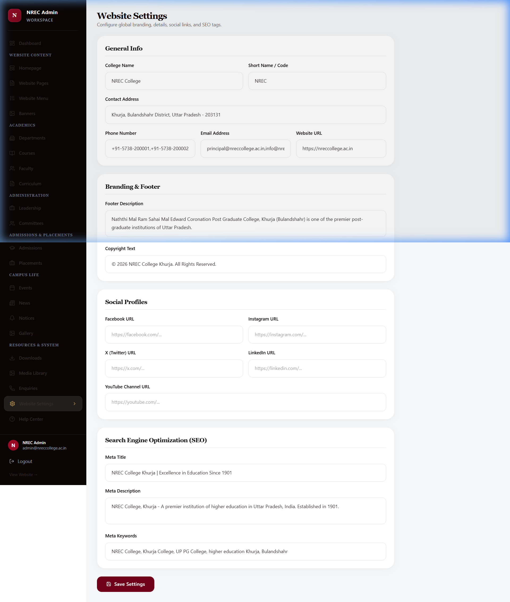

1. **General Info** — Update College Name, Address, Phone, Email, and Website URL.
2. **Branding & Footer** — Edit the footer description and copyright text.
3. **Social Profiles** — Add links to Facebook, Instagram, X (Twitter), LinkedIn, and YouTube.
4. **Search Engine Optimization (SEO)** — Set the Meta Title, Description, and Keywords for Google search results.

### Step-by-Step: Update Phone Number
1. **Navigate to Settings**: Click "Website Settings" in the sidebar.
2. **Find Phone Number**: Scroll to the "General Info" section.
3. **Edit & Save**: Change the number and click "Save Settings".

---

## Help Center

**Purpose:** Access documentation, FAQs, glossary, and support resources.

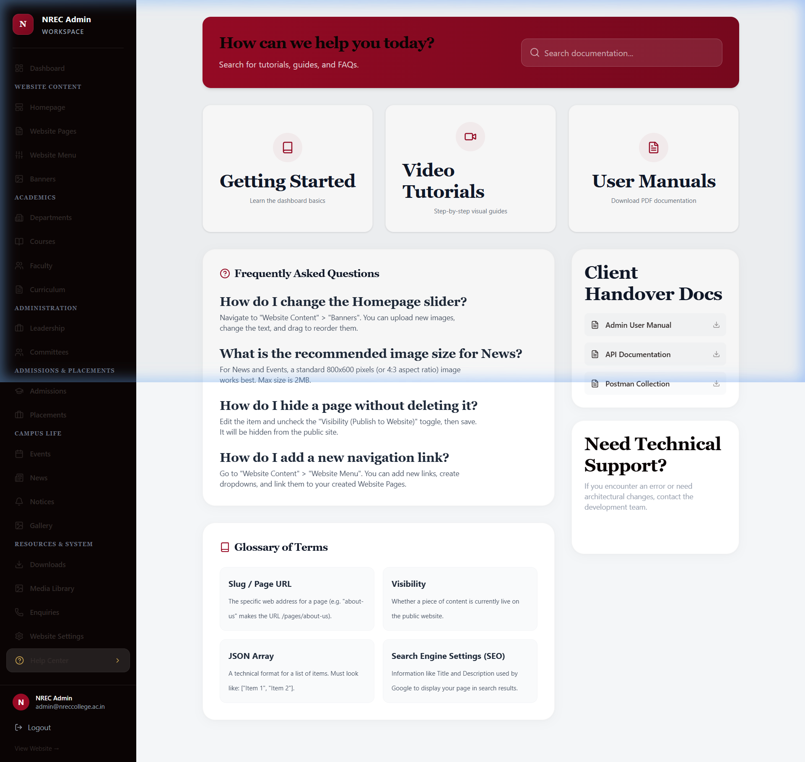

1. **Search Bar** — Search documentation by keyword.
2. **Quick Links** — Jump to Getting Started, Video Tutorials, or User Manuals.
3. **FAQs** — Common questions like "How do I change the Homepage slider?" answered.
4. **Client Handover Docs** — Download the Admin User Manual, API Documentation, and Postman Collection.
5. **Glossary** — Understand technical terms like "Slug / Page URL", "Visibility", "JSON Array", etc.

---
*Generated for NREC College CMS by the Development Team*
